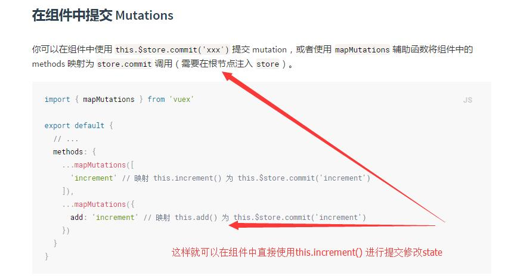

### Vue学习笔记

## Vuex

1. 使用mapMutations辅助函数将组件中的methods映射为store.commit调用。就是可以在组件中直接使用this.increment()方法执行。

  

2. mapState辅助函数：使用mapState函数生成计算属性；当映射的计算属性的名称与state的子节点名称相同时，可以给mapState传一个字符串数组。组件中使用this.count进行取值。

````javascript
//获取state中的count状态
computed: mapState(['count']);
//对象展开运算符；
computed: {
  localComputed () { /* ... */ },
  // 使用对象展开运算符将此对象混入到外部对象中
  ...mapState({//此处重点标注
    // ...
  })
}
````

3. mapAction 在组件中分发Actions,使用mapActions辅助函数将组件的methods映射为store.dispath调用。

````javascript
import { mapActions } from 'vuex'
//在组件中可以使用，this.add()方法
export default {
  // 两种不同方式的映射
  methods: {
    ...mapActions([
      'increment' // 映射 this.increment() 为 this.$store.dispatch('increment')
    ]),
    ...mapActions({
      add: 'increment' // 映射 this.add() 为 this.$store.dispatch('increment')
    })
  }
}
````


### Vue-router

* 使用this.$router.query.geohash进行连接参数的查询

### Vue.js

1. mixin混合：组件复用，可以包含任意组件选项，混入组件中进行使用。

````javascript
new Vue({
    mixins: [mixin]
});
````

  * 选项合并：组件和混合对象含有同名选项时，这些选项将会混合；混合对象的钩子将在组件自身钩子之前调用。值为对象的选项，将被混合为一个对象，两个对象名冲突时，取组件对象的键值对。

````javascript
var mixin = {

  created: function () {
    console.log('混合对象的钩子被调用')
  }

}
new Vue({
  mixins: [mixin],

  created: function () {
    console.log('组件钩子被调用');
  }

});
//合并
var mixin = {

  methods: {

    foo: function () {
      console.log('foo')
    },

    conflicting: function () {
      console.log('from mixin')
    }

  }
}
var vm = new Vue({

  mixins: [mixin],

  methods: {

    bar: function () {
      console.log('bar')
    },

    conflicting: function () {
      console.log('from self')
    }
  }
});
//取组件自身的键值对
````